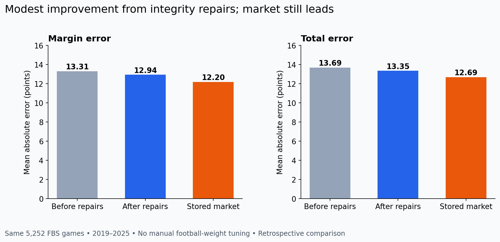
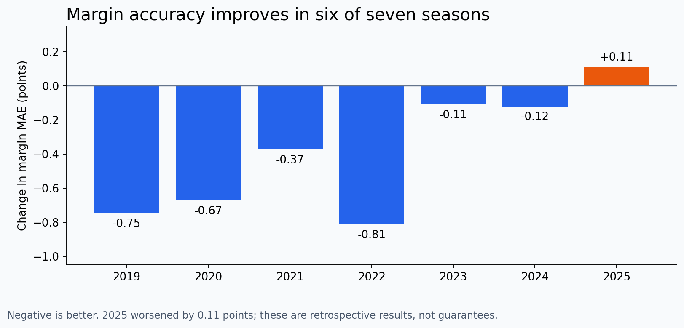

# FBS-only integrity update — implementation and impact

The implementation is ready for a GitHub pull request following local verification.
It has not been pushed. The branch is codex/fbs-only-model-integrity, based on the
latest origin/main merge of the earlier leakage correction.

## What changed

- Both teams must be FBS in the game's season. FBS–FCS rows are excluded from
  model training, predictions, internally calculated ratings, and statistical
  averages. Raw source records are retained. The 2026 modeled schedule contains
  761 FBS matchups; 127 cross-division matchups were removed from the previous
  888-game FBS-involved schedule.
- NDSU and Sacramento State enter their first eligible FBS games at the existing
  1500 Elo default, with zero-centered ridge priors and explicit missing history.
  No permanent FCS membership set or FCS penalty remains. This applies to every
  transitioning program using season-specific CFBD records, not a hardcoded list.
- Historical and upcoming games share the same postgame rolling state. The latest
  eligible game is included once available; upcoming features freeze at issue
  time rather than their future kickoff; incomplete box scores cannot enter
  features. Rest and season game counts use the actual completed calendar, so
  an excluded FCS opponent still correctly affects days off, without its score
  entering statistical form. Games-played counts now reset each season.
- A fixed 24-hour lag from kickoff is used for result availability, because the
  historical feed lacks final-publication timestamps. This intentionally defers
  very recent outcomes; it is an operational protection, not a fitted weight.
- Calendar-week backtesting separates regular season and postseason. Repeated
  provider week numbers cannot group August and bowl games together. Ridge
  snapshots also distinguish dates and season types.
- The backtest now performs **44 fits**, compared with the old seven
  annual fits. The configured four-week cadence and season boundaries are honored.
- The existing 6% validation tail always controls early stopping. The inner linear
  prior excludes validation labels, and the entire hybrid refits on all eligible
  training rows after selecting tree counts.
- ATS and totals separate wins, losses, pushes and zero-edge abstentions. A missing
  provider spread no longer discards an available total. This changes the historical
  total median for four games; scores and spreads are unchanged. Margin/total model
  MAE comparisons are unaffected by which market total is used.
- Refresh uses actual completed schedule weeks; the provider rejects week zero.
  Authentication/network/server errors are no longer silently swallowed. Retries
  are bounded, and unfinished refreshes block model artifacts.
- Forecasts retain game IDs, issue/cutoff times and run IDs. Each run is archived
  with code/input hashes, Git dirty state, package versions and fit details.
  Stale artifacts and inputs changed during a run are rejected. Direct dependencies
  are pinned; API credentials and raw caches remain ignored by Git.
- GitHub Actions runs tests, refreshes once, and then builds, backtests and predicts
  from the same snapshot. A separate test workflow covers Python 3.11 and 3.13.

## Measured impact

Both versions were evaluated on the **same 5,252 games**. These are all FBS vs FBS;
do not compare the new winner percentage to the old 72.8% mixed-division headline.

| Metric | Before | After |
|---|---:|---:|
| Margin MAE | 13.31 | 12.94 |
| Total MAE | 13.69 | 13.35 |
| Winner accuracy | 69.7% | 71.1% |
| Brier score | 0.1940 | 0.1873 |
| ATS, pushes excluded | 49.87% | 49.95% |

The market remains ahead: margin MAE **12.20**, total MAE
**12.69**. ATS results remain effectively 50%.

Mean paired margin-error change: **-0.371 points**.
A 10,000-draw calendar-week block bootstrap gives a descriptive 95% interval of
**-0.519 to -0.225**. Resampling whole
seasons gives **-0.627 to -0.121**;
there are only seven seasons, so uncertainty and dependence remain limitations.
Total-error change is **-0.344**, with week-block interval
**-0.466 to -0.227**.

Six seasons improve on margin MAE. **2025 worsens by 0.11 points.** This is a
combined repair-package comparison, not proof that every individual edit improves
accuracy. No alternative settings were searched in response to these results.

## Forecasts and verification

- 28 regression tests pass on Python 3.11 and Python 3.12; compile checks pass.
- The complete 2019–2025 backtest was run with the final model source and 44 fit
  events. Game IDs and final scores match the earlier audit exactly.
- Latest Week 1 output contains **34 upcoming FBS-only games**, all issued before
  kickoff. NDSU/Sacramento State games against FCS opponents are deliberately absent;
  those programs remain eligible for subsequent FBS matchups.
- The original August 21 CSV is preserved byte-for-byte under out/legacy, SHA-256
  634bb0655a3d83e137885420bc462755dc85ed6bb83d54463b972b06258467ef.
- GitHub-hosted CI has not run for this change because nothing has been pushed.
  The new CI matrix includes Python 3.13; that runtime was not available locally.

## What was not tuned

Elo K, home advantage, offseason regression, ridge regularization/prior-season
weights, LightGBM learning rate/leaves/regularization/tree cap, existing rolling
windows, and the sigma=17 win-probability rule retain their existing settings.
The obsolete FCS anchors and constant FCS indicator columns were removed as part
of the requested scope change. Runtime thread count is capped at four by default.

No roster, quarterback, transfer, coach, opponent-adjustment, time-decay, betting
threshold, or probability-calibration experiment was added. Lifetime averages and
last-three windows retain their existing formulas. Learned fitted coefficients
and selected tree counts naturally change when training data and validation are
corrected; that is different from manually tuning football parameters.

Historical provider inputs are retrospective, market quote timestamps are missing,
and the same past seasons have already been inspected. Preserve frozen future
forecasts to assess generalization before introducing the next model change.

## Reproduction

Run the README refresh/build/backtest/predict sequence. The comparison JSON,
per-season summary and matched-game error CSV accompany this report. The baseline
is the independent leakage-corrected audit reconstruction of source 48adfeb, not
the stale leakage-inflated backtest that originally occupied data_store.
