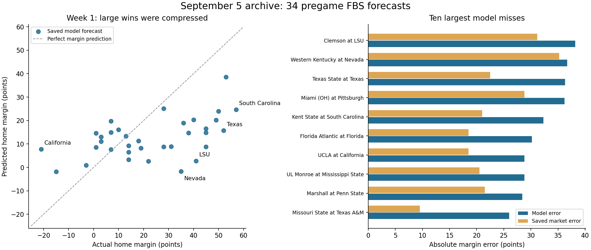
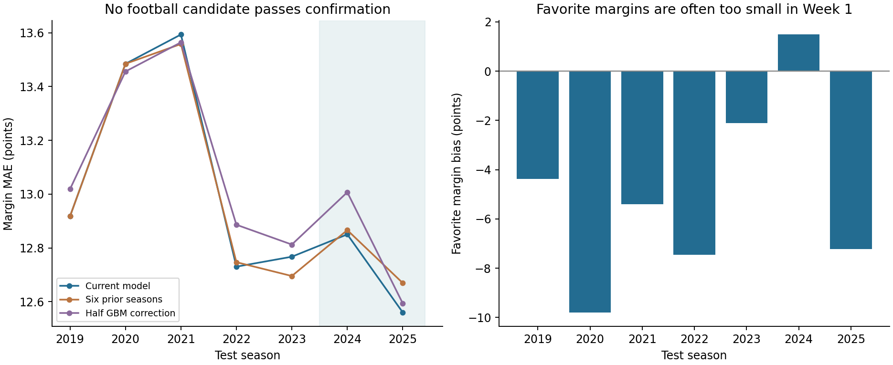

# Week 1 review — September 8, 2026

The current model picked most winners correctly but underestimated winning
margins, particularly in large-favorite matchups. Neither of two fixed weight
experiments improved the historical confirmation sample. Keep the existing
model settings, update its learned ratings with available results, and test
better preseason and efficiency inputs before changing production weights.

## What was actually graded

This review uses GitHub main **988f404**, including the September 5 FBS-only
integrity repairs. The local checkout initially pointed to the older August 22
branch; its forecasts and apparent defects were not treated as the current model.

Primary sample: the published September 5 **10:41 UTC** run,
`20260905T104131379946Z_f2ffde92`: **34 forecasts**, all issued before kickoff,
all now completed, with both teams' box scores available. CFBD's regular-season
Week 1 covers August 29 through September 7 and contains **51 FBS-vs-FBS games**.
The other 17 were not forecast by this model version. No after-the-fact forecasts
fill those gaps. The 99-game legacy file mixes FBS and FCS opponents and is
reported separately below.

Run selection was not documented before the games. We use the repository's
published latest view, then check the earlier 10:29 UTC run rather than choose
the better performer. That earlier run has the same winner, ATS and totals
records; margin MAE is 17.17 rather than 17.19. Conclusions do not change.

Forecast hashes were checked against their original manifests. Windows checkout
had converted line endings; restoring LF produced the exact original Git blob
and manifest hash, without changing any forecast values. `.gitattributes` now
preserves forecast CSV bytes across platforms.

## Scorecard

All market comparisons below use the **lines saved with the forecasts**, on
exactly the same 34 games. Newly downloaded lines do not replace those prices.

| Measure | Current model | Saved market benchmark |
|---|---:|---:|
| Winners correct | 31/34 (91.2%) | — |
| Margin mean absolute error | 17.19 points | 13.92 points |
| Total mean absolute error | 13.41 points | 13.09 points |
| Against the spread | 12 wins, 21 losses, 1 push | — |
| Over/under, using published delta | 14 wins, 19 losses, 1 abstention | — |
| Brier score | 0.0915 | — |

The total delta for UL Monroe–Mississippi State was published as 0.0, so this
review abstains on that game. Subtracting the separately rounded total columns
would create a -0.1 lean and count another loss, producing 14–20. We do not infer
a hidden unrounded decision from rounded columns. ATS grading uses the published
team selection, which avoids the corresponding rounding ambiguity.

The 36.4% ATS rate has a descriptive 95% Wilson interval of **22.2%–53.4%**.
The model's paired margin error exceeds the market by **3.27 points**; a
game-resampling interval is **+0.27 to +6.05**. One slate and correlated games
limit both interpretations. Bookmaker medians are not verified closing lines
or executable prices; this review does not calculate realized betting profit.



## Where it failed, and what the stats show

The systematic error was margin compression: home points were understated by
**5.11** and away points overstated by **5.44**, on average. Total bias was only
**+0.33**, despite substantial total errors in individual games. A blanket
increase to projected combined scoring would not address that pattern.

| Matchup | Predicted home margin | Actual home margin | Home / away yards per play | Home turnover advantage |
|---|---:|---:|---:|---:|
| Clemson at LSU | +2.8 | +41 | 6.85 / 3.02 | 0 |
| Western Kentucky at Nevada | -1.7 | +35 | 8.38 / 4.48 | +1 |
| Texas State at Texas | +15.7 | +52 | 7.37 / 4.99 | +2 |
| Miami (OH) at Pittsburgh | +8.8 | +45 | 8.61 / 4.98 | +1 |
| Kent State at South Carolina | +24.7 | +57 | 8.96 / 3.73 | +1 |
| Florida Atlantic at Florida | +14.8 | +45 | 9.31 / 4.40 | +2 |
| UL Monroe at Mississippi State | +20.2 | +49 | 9.65 / 4.09 | 0 |

Yards per play here is box-score total yards divided by rushing attempts plus
pass attempts. It includes the whole game, including late substitutions, and
is an explanatory observation after the game, not a causal attribution estimate
or a feature allowed into that game's prediction.

LSU's 51–10 result and 644 yards are independently corroborated by its
[official recap](https://lsusports.net/news/2026/09/5/football-smothers-clemson-in-season-opener-51-10).
The CFBD box score has Clemson at 145 yards with one turnover per side.
LSU also scored a defensive touchdown, so equal turnover counts do not imply
equal turnover impact. Still, the efficiency gap was substantial. Mississippi
State outgained UL Monroe 762–278 with neither side turning it over. These
misses cannot reasonably be attributed entirely to turnover-count variance.

Nevada's [official recap](https://nevadawolfpack.com/news/2026/9/6/football-nevada-ground-game-bulldozes-hilltoppers.aspx)
confirms its 49–14 win and a 72-yard rushing touchdown. Texas's
[official recap](https://texaslonghorns.com/news/2026/9/5/no-5-4-football-dominates-texas-state-in-season-opener-59-7)
confirms 59–7. Other row-level results and stats come from the refreshed
[CollegeFootballData API](https://api.collegefootballdata.com/api/docs/).

The three wrong winner picks were Nevada–Western Kentucky, California–UCLA,
and Florida State–SMU. California lost 24–45 despite being projected to win by
7.8; UCLA gained 8.54 yards per play to California's 4.71 and had a +2 turnover
advantage. That game combines a performance mismatch with turnover effects.

Descriptive subgroups, not new selection rules:

- **15 favorites of at least 21 market points:** margin MAE 20.49; their margins
  were understated by 16.91 points on average; model ATS record 5–10.
- **23 away-side ATS selections:** 7–16. The model repeatedly took too many
  points against stronger home teams, although this is a home-heavy opening slate.
- **19 disagreements of at least seven points:** 7–12 ATS. Larger disagreement
  was not a demonstrated edge.
- Even the 17 games with turnover-count differences of zero or one had margin
  MAE 19.33. Turnover differential alone does not explain the failures.

Exceptions matter: Michigan won by only one after being projected to win by
14.6; Oregon won by seven after a 19.7 projection. Increasing all favorites
would worsen those forecasts.

## Is the pattern historical?

Yes, with substantial year-to-year variation. The freshly rebuilt baseline's
**292 regular-season Week 1 games, 2019–2025**, have margin MAE **13.51** versus
the market's **12.16**. Favorite margins are understated by **4.49 points** on
average, compared with **10.65** on the current 34-game slate. For 79 historical
opening-week favorites of at least 21 points, the understatement is **7.75**.

The favorite bias appears in six of seven seasons but reverses in 2024. CFBD's
2020 Week 1 contains only five FBS games because of the disrupted schedule;
the per-year counts are retained in `historical_week1_by_season.csv`. These
patterns motivate hypotheses; they do not justify setting a +4.49 or +7.75
adjustment after inspecting the outcomes.



## Does the model improve as the season progresses?

The historical evidence supports that expectation for margin forecasts, especially
the tendency to understate favorites, but does not show that the model eventually
beats the market. This follow-up uses the same baseline's **4,972 regular-season
games**; postseason games are excluded from these phase comparisons.

| Season phase | Games | Model margin MAE | Market margin MAE | Favorite margin bias |
|---|---:|---:|---:|---:|
| Week 1 | 292 | 13.51 | 12.16 | -4.49 |
| Weeks 2–4 | 977 | 13.32 | 12.18 | -2.65 |
| Weeks 5–8 | 1,413 | 12.65 | 12.01 | -0.54 |
| Weeks 9 onward | 2,290 | 12.90 | 12.34 | -0.63 |

Negative favorite bias means the predicted winning margin is too small.
The model's margin-error disadvantage to the market narrows from **1.35 points**
in Week 1 to **0.64** in Weeks 5–8 and **0.56** from Week 9 onward. Excluding the
unusual 2020 season preserves the pattern. Margin accuracy does not improve
monotonically, and total MAE changes little (13.39, 13.32, 13.14, 13.45 across
these phases). Winner accuracy also does not rise: later schedules contain
different, often more competitive matchups.

The football mechanism is plausible: Elo/ridge ratings incorporate new results,
the last-three-game features begin describing the current roster, and refits
learn from additional eligible games. Early projections instead rely heavily
on past-season information that does not explicitly encode offseason changes.
However, these phase comparisons involve different games and schedule difficulty;
they do not isolate the causal benefit of additional data.

My assessment is that the **margin-compression problem is strongly concentrated
early in the season**, while the model's broader market disadvantage is persistent.
Historical ATS rates are 51.9%, 48.1%, 49.4%, and 50.6% across these phases, giving
no evidence of an automatic later-season betting edge. This year's 17.19-point
opening-slate MAE is also substantially worse than the historical opening-week
average. Expect some improvement as current-season evidence accumulates, but
do not assume time alone will fix missing roster inputs or all modeling errors.

The detailed counts and every season's results are saved in
`season_phase_metrics.csv` and `season_phase_by_year.csv`; no weights were tuned
for this follow-up.

## Weight experiments and decision

The [fixed experiment plan](experiment_plan.md) was saved before candidate
backtesting, after the current Week 1 misses were inspected. Every candidate
used the same source snapshot and chronological availability rules. No 2026
outcomes enter these 2019–2025 fits. Across both fitted candidates there were
**88 fits**; the half-correction and market comparisons reuse baseline outputs.

Development was 2019–2023 (3,646 games); confirmation was 2024–2025 (1,606).
Confirmation is retrospective: these seasons were already studied in prior
integrity work, so prospective performance is still required.

| Margin MAE, lower is better | Development | Confirmation | Historical Week 1 |
|---|---:|---:|---:|
| Unchanged baseline | 13.071 | 12.704 | 13.507 |
| Six prior seasons plus completed current-season games | 13.051 | 12.767 | 13.549 |
| Half the learned GBM margin correction | 13.125 | 12.799 | 14.305 |
| Fixed 50% model / 50% market comparator | 12.529 | 12.166 | 12.506 |

**Reject both football changes.** Recent-only training's small development
gain disappears in confirmation: +0.063 points worse, with worse margins in
both 2024 and 2025. Halving corrections is +0.095 worse in confirmation and
especially harmful in opening weeks. Confirmation season-bootstrap ranges are
+0.016 to +0.109 and +0.034 to +0.157 respectively; these use only two season
blocks and should not be interpreted as precise population uncertainty.

The market blend improves on the model but **does not beat market-only**:
across all 5,252 games, blend margin MAE is 12.42 versus market-only 12.20;
total MAE is 12.82 versus 12.69. Historical quote timing is unknown. Treat this
as evidence that the market contains useful information, not a validated
new wagering strategy or a reason to adopt 50% as an optimized weight.

The fresh baseline is 12.96 margin MAE / 13.37 total MAE, slightly different
from September 5's published 12.94 / 13.35. The old machine's exact input files
are unavailable here. We refreshed provider data and reran on this environment;
we cannot attribute that small difference to one cause. All candidate differences
above use the same newly rebuilt baseline, not a comparison across snapshots.

## What to change next

1. **Improve the preseason strength prior.** Current-year roster, starting-QB,
   returning-production and coaching information have no dedicated inputs.
   The current model uses prior-season SP+ and ratings based on earlier games.
   LSU's official recap documents a new coach and quarterback debut; historical
   team averages cannot directly represent those changes. Test timestamped
   preseason inputs with missingness flags, rather than retrospectively fetching
   current-year SP+ and assuming it was known before kickoff.
2. **Test recent, opponent-adjusted efficiency features.** Existing full-history
   averages mix many rosters; the last-three window is short and noisy. A
   predeclared, regularized recent window or decay, shrunk toward preseason
   expectations, is a better targeted experiment than merely dropping old
   training rows. Fit opponent adjustment on prior games only. Include an
   offseason-specific calibration of ridge/SP+ contributions as a separate
   candidate; the present experiment did not test those changes.
3. **Model totals from actual pace and efficiency.** The current `pace_*`
   features are time of possession, not play rate. Test plays or possessions
   per game plus points per possession; separate turnover and return scores
   where historical data support it. Week 1 has large errors in both directions,
   so a blanket total offset is not supported.
4. **Validate confidence and edges on new forecasts.** Keep sigma=17 for now;
   31/34 winners does not establish calibration. Use season-based validation
   for any probability recalibration and log timestamped market observations.
   Adopt a run-selection rule before the next games; an immutable run explicitly
   designated for evaluation is simpler than selecting among many runs afterward.

These are ranked hypotheses, not claims of demonstrated improvement. Fix each
candidate before testing, report all folds and subgroups, and require improvement
on future pregame forecasts before increasing confidence in it. Preserve the
FBS-only scope; do not reintroduce mixed-division samples to inflate winner accuracy.

## Refit completed

The unchanged model was refit with **9,135 eligible games**, versus 9,097 at
the September 5 issue cutoff. Fifty of the 51 completed 2026 FBS games are
available to training. Monday's SMU–Florida State game remains excluded until
September 8 at 23:30 UTC under the existing 24-hour availability rule. Its result
is nevertheless included in this evaluation, where the feed confirms it is final.

The learned linear prior changed normally during fitting:

| Prior term | September 5 reconstruction | After Week 1 refit |
|---|---:|---:|
| Intercept, points | 3.186 | 3.233 |
| SP+ difference coefficient | 0.1004 | 0.1082 |
| Ridge difference coefficient | 1.7075 | 1.7033 |
| Elo difference / 12 coefficient | -0.1601 | -0.1640 |

These are correlated regression coefficients, **not percentages of importance**.
The negative conditional Elo coefficient does not mean better teams are
intrinsically penalized. GBM corrections are added to this linear component.
Reconstruction differs from archived margins by up to 1.49 points, so these
weights explain the current snapshot, not an exact reconstruction of the original
machine's fitted model. The original CSV, not the reconstruction, was graded.

In that reconstruction, Texas's prior is only +8.27 and the GBM **adds** +7.85.
Alabama's prior is +5.96 and the GBM adds +8.71. This helps explain why reducing
the correction weight did not fix compressed margins: the prior itself is small.

Margin/total trees selected after the refit: **56 / 136**. Model files and weights
are saved locally under `data_store/models/2026_after_week1/`. **49 future Week 2
forecasts** were issued in `20260908T124047636305Z_bed5eb6b`, with original
Week 1 forecasts preserved. No production football hyperparameters changed.

## Legacy file, kept separate

| Older August forecast sample | Winners | Margin MAE | ATS |
|---|---:|---:|---:|
| All 99 games, including FCS | 84/99 | 16.62 | 43–55 |
| Its 51 FBS games | 39/51 | 16.33 | 21–30 |
| Same 34 games as September 5 | 30/34 | 16.04 | 13–21 |

The old model did better on margins on that same 34-game subset, despite its
known training-integrity problems. That is not sufficient evidence to revert
the repairs. Its market observations and issue timing differ, and it has no
original issue-time manifest. The old local 99-game file was preserved before
refreshing anything.

## Reproduction and artifacts

From the repository root, after refreshing sources:

```bash
python -m cfb_model.backtest.grade --forecast data_store/out/runs/20260905T104131379946Z_f2ffde92/predictions.csv --games data_store/games_all.parquet --output reports/2026-09-08-week1
python -m scripts.week1_diagnostics
python -m cfb_model.features.build
python -m scripts.week1_experiments
python -m scripts.week1_conclusions
python -m scripts.season_phase_review
python -m scripts.week1_refit
python -m pytest -q
```

Diagnostic chart scripts additionally require matplotlib. Grading itself uses
the project's existing dependencies. A later refit creates a new timestamped
forecast; it does not reproduce this exact run ID or data snapshot. Scripts
write research outputs separately from production historical backtest files.

`grading.json` and `diagnostics.json` record input hashes and archive sensitivity.
`graded_games_with_stats.csv` contains every graded game and both box scores;
`historical_candidate_predictions.csv`, `historical_metrics.csv`,
`experiment_fits.json`, `paired_effects.json`, and `promotion_decisions.json`
retain all candidate results, including unsuccessful ones. Raw refreshed sources
remain in the local data store. The original local caches are backed up under
`data_store/audit_2026_w1/`.

Validation: **34 tests passed**, plus Python compilation and visual inspection
of both charts. Regression checks cover late forecasts, duplicate/mismatched
games, pending results, pushes, abstentions and published rounding behavior.
The review and code are on branch `codex/week1-review`; production model settings
remain unchanged.
